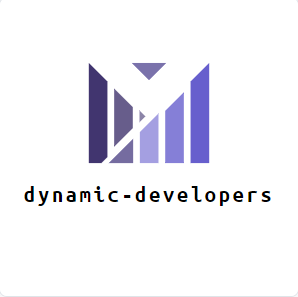

<h1 align="center">Dynamic Developers</h1>
 

## 🖥 Team Members:
* **Preslav Penchev** - *Scrum trainer* 
* **Raqn Hristov** - *Back-end developer* 
* **Yusmen Osman** - *Back-end developer* 
* **Yordan Zhechev** - *QA Engineer* 

## 🚀 Used Technologies:

 
    
    
    
    
    
  
  
  
## 📄 Documents
      
   [Project Documentation](https://codingburgas-my.sharepoint.com/:w:/g/personal/prpenchev20_codingburgas_bg/ERtZvo4jucFEmm-bKOpQSVIBBnb7O-Evf-qVaDBI5UHsVw?e=fQ2O7n)
  
   [Presentation](https://codingburgas-my.sharepoint.com/:p:/g/personal/prpenchev20_codingburgas_bg/EXvHSEh3u_hChp0tSmq8nZMBUpsl7dYYI0Z838ajoZGVnw?e=rSsvqp)
